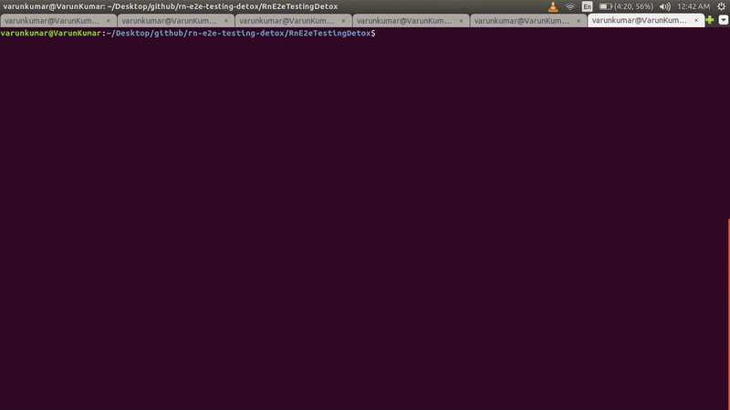

# react-native e2e testing using detox

Step by step guide for end to end testing in react native (Android) using detox

### About this app

This app has been created using `react-native init` and then edited to contain a login form for the demonstration of integration testing using [detox](https://github.com/wix/Detox/).

### Prerequisites

1. You must have `node` and `npm` already setup in your machine
2. Install Detox command line tool globally using `npm install -g detox-cli`

### Installing and setting up detox in Android

1. Go to your react native project directory, e.g. `cd RnE2eTestingDetox/`
2. Install `detox` as dev dependency `yarn add detox -D`
3. Add following configuration in `android/build.gradle` inside `allprojects.repositories`

```
maven {
    // All of Detox' artifacts are provided via the npm module
    url "$rootDir/../node_modules/detox/Detox-android"
}
```

4. Inside `android/build.gradle`, change minSdkVersion to 18 and add `kotlinVersion = "1.3.41"` in `ext` block

```
ext {
    buildToolsVersion = "28.0.3"
    minSdkVersion = 18
    compileSdkVersion = 28
    targetSdkVersion = 28
    kotlinVersion = "1.3.41"
}
```

5. Inside `android/build.gradle`, add the Kotlin Gradle-plugin to your classpath

```
dependencies {
    classpath("com.android.tools.build:gradle:3.4.2")
    classpath "org.jetbrains.kotlin:kotlin-gradle-plugin:$kotlinVersion"

    // NOTE: Do not place your application dependencies here; they belong
    // in the individual module build.gradle files
}
```

6. Inside `app/build.gradle`, add the following two lines in `android.defaultConfig` block

```
defaultConfig {
  testBuildType System.getProperty('testBuildType', 'debug')  // This will later be used to control the test apk build type
  testInstrumentationRunner 'androidx.test.runner.AndroidJUnitRunner'
}
```

7. Inside `app/build.gradle`, add the following line in `android.buildTypes.release` block

```
// Detox-specific additions to pro-guard
proguardFile "${rootProject.projectDir}/../node_modules/detox/android/detox/proguard-rules-app.pro"
```

8. Inside `app/build.gradle`, add the following lines in `dependencies` section

```
androidTestImplementation('com.wix:detox:+') { transitive = true }
androidTestImplementation 'junit:junit:4.12'
implementation "androidx.annotation:annotation:1.1.0"
```

9. Add the file `android/app/src/androidTest/java/com/[your.package]/DetoxTest.java`. Don't forget to change the package name to your project's. Refer [DetoxTest.java](https://github.com/wix/Detox/blob/master/examples/demo-react-native/android/app/src/androidTest/java/com/example/DetoxTest.java)

10. Hit `detox init -r jest` to use jest as test-runner. Its output will be something like-

```
detox[27185] INFO:  [init.js] Created a file at path: e2e/config.json
detox[27185] INFO:  [init.js] Created a file at path: e2e/init.js
detox[27185] INFO:  [init.js] Created a file at path: e2e/firstTest.spec.js
detox[27185] INFO:  [init.js] Patching package.json at path: ~rn-e2e-testing-detox/RnE2eTestingDetox/package.json
detox[27185] INFO:  [init.js]   json["detox"]["test-runner"] = "jest";
```

11. Add the following configuration inside `package.json`. (`test-runner`would already be there created in last step)

```
"detox": {
    "configurations": {
      "android.emu.debug": {
        "binaryPath": "android/app/build/outputs/apk/debug/app-debug.apk",
        "build": "cd android && ./gradlew assembleDebug assembleAndroidTest -DtestBuildType=debug && cd ..",
        "type": "android.emulator",
        "name": "Nexus_4_API_23"
      },
      "android.emu.release": {
        "binaryPath": "android/app/build/outputs/apk/release/app-release.apk",
        "build": "cd android && ./gradlew assembleRelease assembleAndroidTest -DtestBuildType=release && cd ..",
        "type": "android.emulator",
        "name": "Nexus_4_API_23"
      }
    },
    "test-runner": "jest"
  }
```

12. Note that in above configuration, I am using `"name": "Nexus_4_API_23"`. This is the name of my emulator device. You can find yours using-

```
// ANDROID_HOME environment variable is set to Android Sdk directory (/Android/Sdk)
$ANDROID_HOME/emulator/emulator -list-avds
```

13. Build a debug apk using `detox build -c android.emu.debug`

14. Edit `./e2e/firstTest.spec.js` file to have your app specific testing instructions. For this example app, it would be-

```
describe('Login flow test', () => {
  beforeEach(async () => {
    //await device.reloadReactNative();
  });

  it('should have login screen', async () => {
    await expect(element(by.id('loginView'))).toBeVisible();
  });

  it('should fill login form', async () => {
    await element(by.id('usernameInput')).typeText('varunk');
    await element(by.id('passwordInput')).typeText('test123\n');
    await element(by.id('loginButton')).tap();
  });

  it('should show dashboard screen', async () => {
    await expect(element(by.id('dashboardView'))).toBeVisible();
    await expect(element(by.id('loginView'))).toNotExist();
  });
});
``` 

15. Run e2e testing `detox test -c android.emu.debug`

### Demo



### Git diff for setting up Detox in react-native Android

https://github.com/varunon9/rn-e2e-testing-detox/commit/8536e816cd256e75794a8327a94400f462326f03